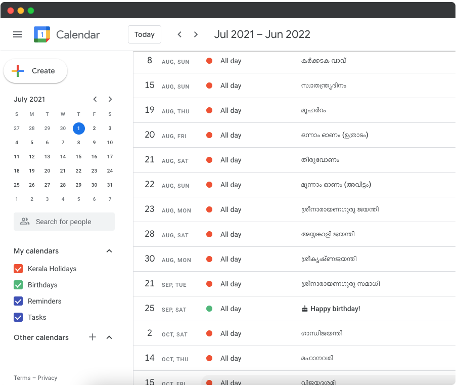

# Malayalam-Holidays
Generate iCal (.ics) files of Holidays in Kerala in Malayalam/English.

The output of this python program is '.ics' file, which can be easily imported to any iCal combatible calendar application such as Google Calendar, NextCloud, etc.

### Requirements
* Python 3.x
* [Glob](https://pypi.org/project/glob2/)

### Usage

```python
python generate.py -y 2021
python generate.py -y [year1] [year2]...
```

For specific language,
```python
python generate.py -y 2021 -l eng
```



Sometimes you may want to use _python3_ instead of _python_ according to your operating system.
_years_ are optional arguments. If no years are given as arguments, all the available calendars are generated.


### Download generated ICS Files
[Click here](https://github.com/shajilkrazy/malayalam-holidays/releases) to download the generated '.ics' files.
